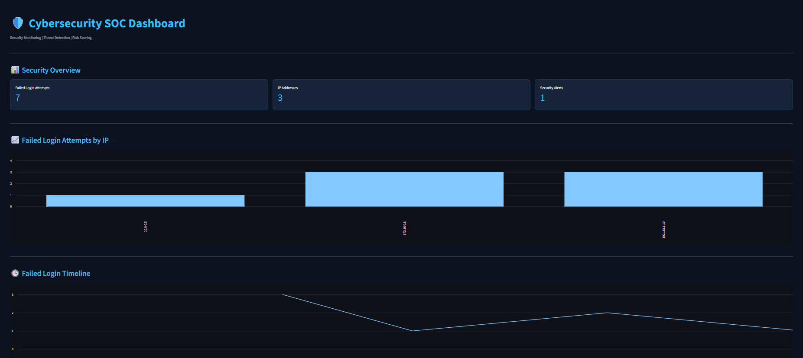

# Cybersecurity Log Analyzer

**Python-Based Security Log Analysis and Threat Detection**

A cybersecurity project developed using Python, Streamlit, and SQLite to analyze authentication logs, detect suspicious login activity, assess IP address risks, and manage security alerts through a web-based SOC dashboard.

This project was built as a personal learning experience to develop practical skills in defensive cybersecurity, Python programming, and security monitoring.

## Live Demo

Try the application directly in your browser:

**[Open Cybersecurity SOC Dashboard](https://y7aseer-cybersecurity.streamlit.app/)**

**GitHub Repository:** [Cybersecurity Log Analyzer](https://github.com/y7aseer/cybersecurity-log-analyzer)

## Dashboard Preview



## Features

### Security Log Analysis
- Reads authentication log files.
- Extracts timestamps and IP addresses.
- Identifies failed login attempts.

### Brute Force Detection
- Detects repeated failed login attempts from the same IP address.
- Uses a time-based detection window.
- Generates alerts for potentially suspicious activity.

### IP Risk Assessment
- Analyzes failed login behavior for each IP address.
- Calculates behavior-based risk scores.
- Assigns risk levels to help prioritize investigation.

### SOC Dashboard
- Displays security monitoring metrics.
- Provides IP address filtering.
- Shows IP risk assessments in a table.
- Displays detected security alerts.
- Supports uploading security log files.

### Automatic Monitoring
- Supports refresh intervals of 5, 10, 30, and 60 seconds.
- Allows monitoring to be paused.
- Reanalyzes available log data during automatic refresh.

### Security Alert Management
- Displays new security alerts.
- Allows users to acknowledge reviewed alerts.
- Tracks alert status and acknowledgement timestamps.
- Maintains alert history using SQLite.

### Report Export
- Exports security alerts in JSON format.
- Exports IP risk assessments in CSV format.

### Automated Testing
- Includes 21 unit tests for core analysis functionality.
- Uses Python's built-in unittest framework.

## Technologies Used

| Technology | Purpose |
|---|---|
| Python | Core application development |
| Streamlit | Web-based SOC dashboard |
| Pandas | Data processing and reporting |
| SQLite | Alert storage and management |
| Unittest | Automated testing |
| Git & GitHub | Version control |
| Streamlit Community Cloud | Application deployment |

## Project Structure

```text
cybersecurity-log-analyzer/
├── main.py
├── detector.py
├── threat_intelligence.py
├── report_export.py
├── dashboard.py
├── database.py
├── security.log
├── requirements.txt
├── README.md
└── screenshots/
    └── dashboard.png
```

### Main Files

- **main.py:** Reads and analyzes security logs.
- **detector.py:** Detects potential brute-force attacks.
- **threat_intelligence.py:** Calculates IP risk scores using login behavior.
- **report_export.py:** Generates JSON and CSV reports.
- **dashboard.py:** Provides the security monitoring interface.
- **database.py:** Stores and manages security alerts using SQLite.

## Installation

### 1. Clone the Repository

```bash
git clone https://github.com/y7aseer/cybersecurity-log-analyzer.git
cd cybersecurity-log-analyzer
```

### 2. Install Dependencies

```bash
python -m pip install -r requirements.txt
```

### 3. Run the Dashboard

```bash
python -m streamlit run dashboard.py
```

The application will be available at:

`http://localhost:8501`

## Example Security Logs

The application processes logs using this format:

```text
2026-10-08 10:00:01 | FAILED | 192.168.1.100
2026-10-08 10:00:10 | FAILED | 192.168.1.100
2026-10-08 10:00:20 | FAILED | 192.168.1.100
```

Repeated failed login attempts from the same IP address within a short period may indicate a brute-force attack.

## How It Works

1. The application reads authentication logs.
2. It identifies failed login attempts.
3. It analyzes repeated failures within a time window.
4. It detects suspicious authentication patterns.
5. It calculates behavior-based IP risk scores.
6. It generates and stores security alerts.
7. The SOC dashboard displays the results.
8. Users can acknowledge alerts and export reports.

## Running Tests

Run the test suite using:

```bash
python -m unittest discover -v
```

The project includes 21 unit tests covering core analysis functionality.

## Cloud Deployment

The dashboard is deployed on Streamlit Community Cloud.

**Live Demo:** https://y7aseer-cybersecurity.streamlit.app/

The deployed version is intended for demonstration purposes. SQLite data stored on the cloud instance may be lost after restarts or redeployments, and visitors may share the same alert database.

Use synthetic logs only. Do not upload sensitive or production security data.

## Project Limitations

- The application analyzes supported authentication log files rather than live network traffic.
- Detection uses rule-based logic and may produce false positives.
- Risk scores are based on observed log behavior, not external threat intelligence feeds.
- The application does not automatically block suspicious IP addresses.
- The project is an educational security monitoring tool, not a production SIEM platform.

## Skills Demonstrated

- Python development
- Log analysis
- Brute-force detection
- Defensive security monitoring
- Security alert management
- IP risk assessment
- SQLite database integration
- Automated testing
- Cloud deployment
- Git and GitHub

## Author

Developed by [@y7aseer](https://github.com/y7aseer) as a personal cybersecurity learning project.

**Live Demo:** [Cybersecurity SOC Dashboard](https://y7aseer-cybersecurity.streamlit.app/)